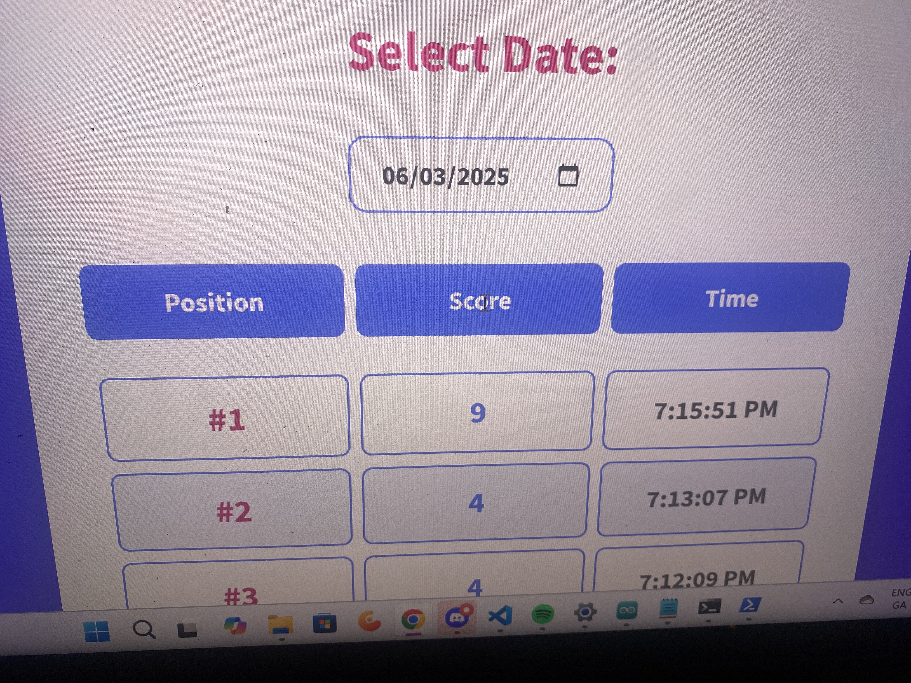

# Accessible Simon Says

A Simon Says game designed for children of all abilities, including blind and colorblind players.

## The Problem

Traditional Simon Says games rely on visual cues—flashing colors without any way for blind children to know which button is which. This excludes an entire group of kids from playing.

## Our Solution

We built a Simon Says game with three core accessibility features:

1. **Different frequency buzzes** for each color (red: 300Hz, yellow: 450Hz, green: 600Hz)
2. **Physical braille labels** under each button so blind players can identify colors by touch
3. **Colorblind-friendly palette** (blue, purple, pink instead of red/green)

The game also runs slower than commercial versions to accommodate different learning speeds.


## Hardware

- ESP32 microcontroller
- 3 LED buttons (red, yellow, green)
- Buzzer for audio feedback
- 7-segment display for round counter
- On/off button

## How It Works

1. Press the on/off button to start
2. Watch/listen as the game shows a sequence of colors
3. Repeat the sequence by pressing the buttons
4. Each round adds one more color to remember
5. Game ends after a mistake or reaching 9 rounds
6. Score is sent to the leaderboard over WiFi

## Leaderboard Website

A local Flask server displays real-time scores:

- **Daily Scores**: View scores from any date
- **Top Scores**: All-time top 10 players
- Updates live as games finish


### Running the Website

```bash
python app.py
```

Visit `http://localhost:5000` to see the leaderboard.

## Setup

### ESP32 Configuration

1. Open [ESP32Code/esp32.ino](ESP32Code/esp32.ino) in Arduino IDE
2. Set your WiFi credentials and server IP (lines 5-7):
   ```cpp
   const char* ssid = "your-wifi-name";
   const char* password = "your-password";
   const char* serverURL = "http://your-computer-ip:5000/game_result";
   ```
3. Upload to ESP32

### Required Libraries

- WiFi.h
- HTTPClient.h
- ArduinoJson.h
